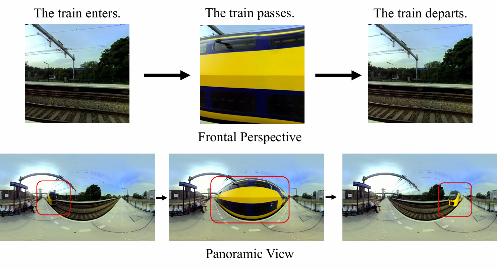
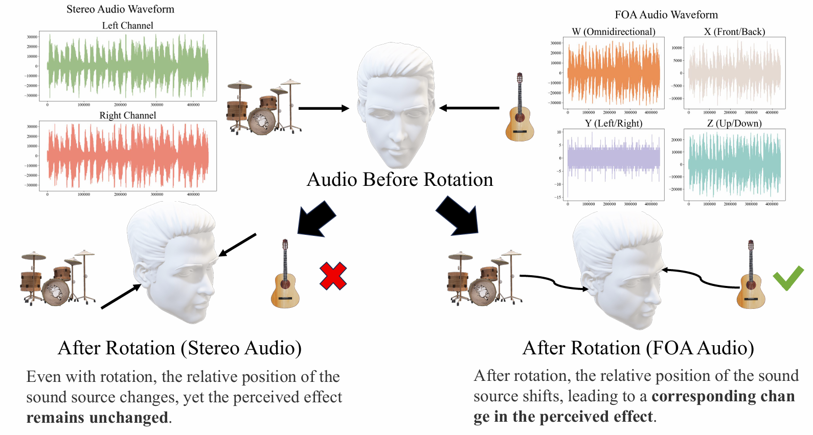

# AudioSpace: Generating Spatial Audio from 360-Degree Video  

✨🔊 Transform your 360-degree videos into immersive spatial audio! 🌍🎶  

   

PyTorch Implementation of **AudioSpace**, a model for generating spatial audio from 360-degree videos.  

We provide our implementation and pretrained models as open-source in this repository. 🚀💡  

---

## 🎬 Quick Start  
We provide an example of how you can perform inference using AudioSpace.  

### 🏃 Inference with Pretrained Model  
To run inference, follow these steps:  

1️⃣ **Navigate to the root directory.** 📂  
2️⃣ **Create the inference environment:**  
   ```bash
   conda env create -f environment.yml
   ```  
3️⃣ **Activate the environment:**  
   ```bash
   conda activate Audiospace_infer
   ```  
4️⃣ **Run inference with the provided script:**  
   ```bash
   bash demo.sh video_path checkpoint_dir cuda_id
   ```  
💡 *You can also modify `demo.sh` to change the output directory.* The `cases` folder contains some sample 360-degree videos in the equiangular format—make sure your videos follow the same format! 🎥✨  

---

## 📊 Evaluation  
To evaluate generated audio, follow these steps:  

1️⃣ **Navigate to** `metrics/evaluate`. 📂  
2️⃣ **Create the evaluation environment:**  
   ```bash
   conda env create -f environment.yml
   ```  
3️⃣ **Modify `eval.sh`** to specify:  
   - 🎧 The path to real (ground truth) audio files  
   - 🎵 The path to generated audio files  
   - 📜 The text file containing the names of the audio files to be compared  

Before running `eval.sh`, make sure to fill in these variables inside the script:  
```bash
reference_path=""    # Path to ground truth audios  
split_path="samples.txt"  # Path to split txt  
result_path=""    # Path to save results  
```  

4️⃣ **Run evaluation:**  
   ```bash
   bash eval.sh cuda_id
   ```  

✨ **Done!** 🎉 Now you can compare the generated spatial audio with the ground truth! 🚀🔍  

---

💡 *Have fun experimenting with AudioSpace! 🛠️💖*